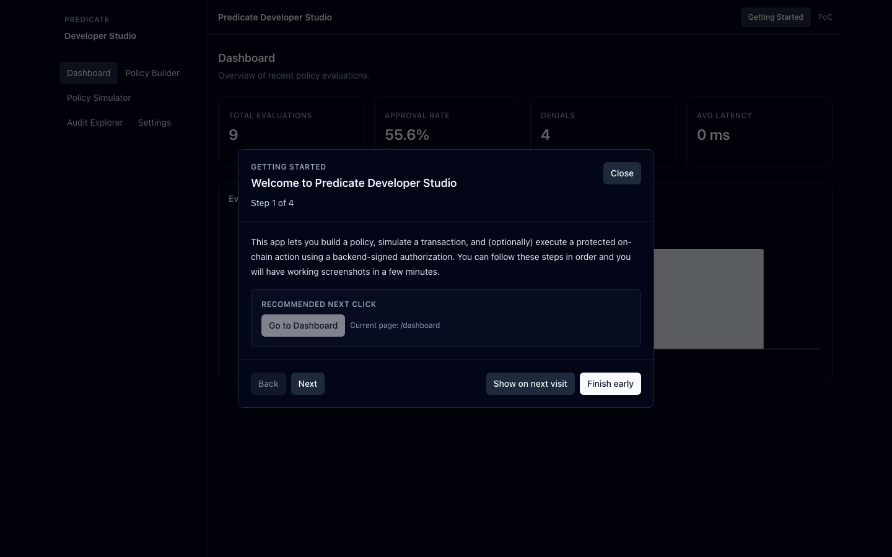
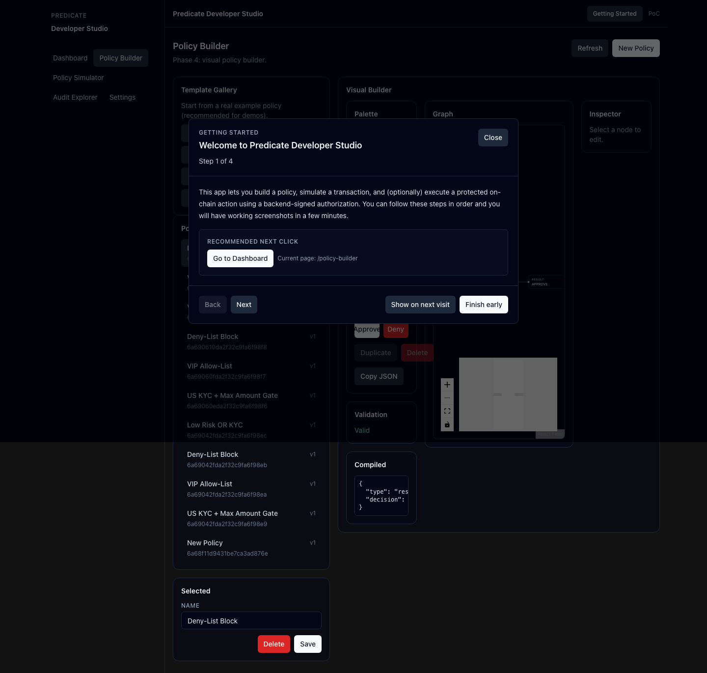
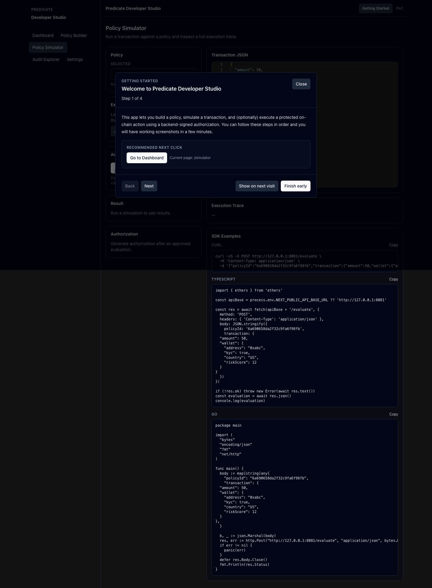
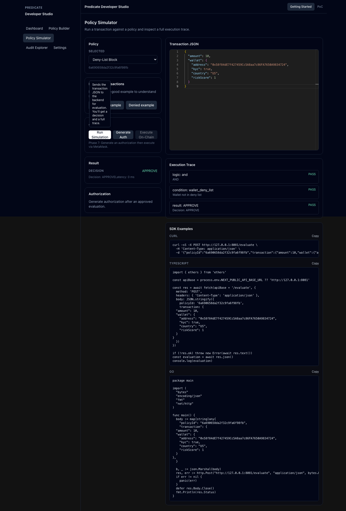
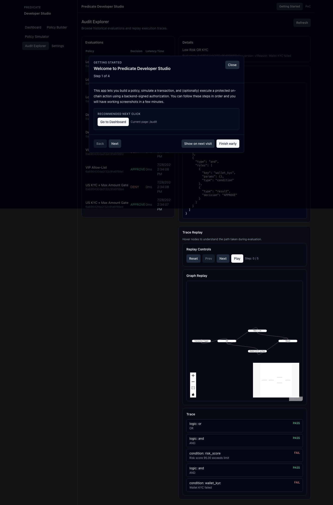
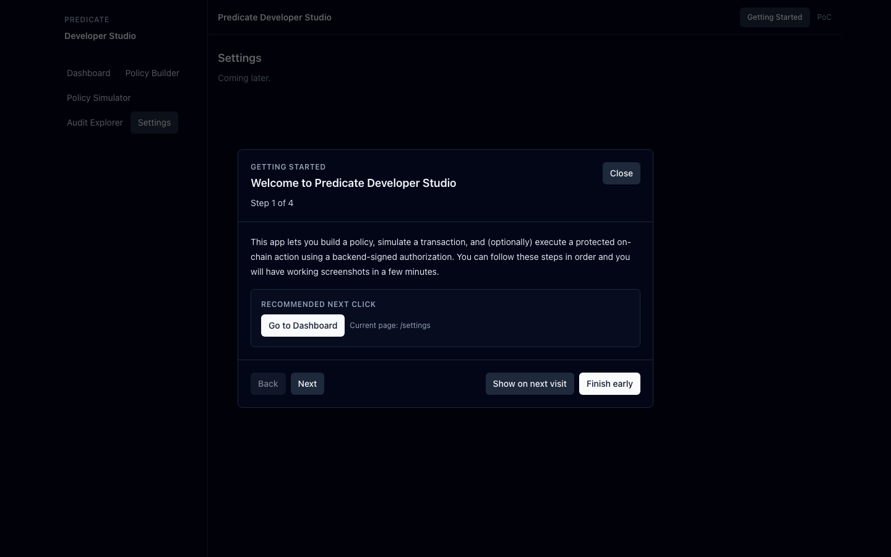

# Predicate Developer Studio

Production-quality proof of concept for a **policy-driven blockchain transaction developer platform**.

This repo is tailored to Predicate’s developer platform goals: **Go backend services**, a **polished Next.js dashboard**, and a **smart-contract-layer enforcement story** that is approachable to developers and auditable for risk/compliance.

## What this PoC demonstrates

- **Developer workflow** to author, test, and ship transaction policies
- **Explainability** via decision reasons and full execution traces
- **Cryptographic enforcement** by verifying a backend signer’s authorization inside a Solidity contract
- **Operational tooling**: dashboard metrics + audit/replay views to understand “what happened and why”

## Executive-relevant use cases

- **Regulated on-chain transaction gating**
  - KYC checks, country restrictions, deny/allow lists, risk thresholds, max transfer limits.
- **Offchain checks with onchain guarantees**
  - Backend signs an authorization only after checks pass; contract verifies signature, expiry, and replay protection.
- **Auditability and incident response**
  - Historical evaluation records can be replayed with traces and policy snapshots.
- **Developer platform ergonomics**
  - Visual builder templates + simulator examples reduce time-to-first-success for new developers.

## Repository layout

- `web/frontend/` Next.js (App Router) static dashboard UI
- `web/backend/` Go 1.24+ REST API (standard `net/http`)
- `web/contracts/` Solidity contract + deploy script

## Product walkthrough (screens)

- **Dashboard**
  - Recent evaluation volume, approval rate, denials, latency.
- **Policy Builder**
  - Template gallery + visual policy graph (React Flow), validation, compiled output, tooltips.
- **Policy Simulator**
  - Example transaction buttons, evaluation trace viewer, authorization generation, on-chain execution via MetaMask.
- **Audit Explorer**
  - Browse stored evaluations, view policy snapshot, replay traces on the stored policy graph.

## Screenshots

| Dashboard                                                       | Policy Builder                                                                    |
| --------------------------------------------------------------- | --------------------------------------------------------------------------------- |
|   |           |
| Simulator                                                       | Simulator (Result)                                                                |
|   |  |
| Audit Explorer                                                  | Settings                                                                          |
|  |                       |

## Frontend (Next.js)

### Requirements

- Node.js 20.x

### Install

```bash
npm install
```

Run from `web/frontend/`.

### Dev

```bash
npm run dev
```

### Build (static export)

This project is configured for static export:

```bash
npm run build
```

Outputs to `frontend/out/`.

Static export cannot be served with `next start`. Use:

```bash
npm run build
npx serve@latest out
```

## Backend (Go)

### Requirements

- Go 1.24+
- MongoDB Atlas (or local MongoDB)

### Environment

Backend reads:

- `HOST` (default `127.0.0.1`)
- `PORT` (default `8080`)
- `MONGODB_URI` (**required**)
- `MONGODB_DB` (default `predicate_developer_studio`)

Example:

```bash
export MONGODB_URI='mongodb+srv://<user>:<pass>@<cluster>/<db>?retryWrites=true&w=majority'
export MONGODB_DB='predicate_developer_studio'
```

### Run

From `web/backend/`:

```bash
go run ./cmd/api
```

### Health check

```bash
curl http://127.0.0.1:8080/health
```

## Implemented features (Phases 1-7)

- **Phase 1**
  - Next.js App Router scaffold with Tailwind
  - Go service scaffold with `/health`
  - MongoDB connection wiring (connect + ping)

- **Phase 2**
  - Clean architecture backend layers (models/repositories/services/handlers)
  - Policy CRUD: `/policies`

- **Phase 3**
  - Dashboard UI with charts
  - Policy CRUD UI
  - Evaluations/Audit list endpoints backed by Mongo (empty-safe)

- **Phase 4**
  - Visual Policy Builder using React Flow
  - Graph validation
  - Graph + compiled policy JSON persisted in Mongo

- **Phase 5**
  - Policy evaluation engine (AND/OR/conditions/result)
  - Full execution traces
  - `POST /evaluate` persists evaluations (with policy snapshot)

- **Phase 6**
  - Policy Simulator (Monaco transaction editor)
  - Trace viewer + SDK examples

- **Phase 7**
  - Solidity contract `PredicateProtectedAction.sol`
  - `POST /authorize` signed authorizations (replay + expiry protection)
  - Frontend can generate auth + execute on-chain via MetaMask

- **Phase 8**
  - Audit Explorer: browse evaluations
  - Policy Trace Explorer: replay trace events on the stored policy graph
  - Replay endpoint: `GET /evaluations/{id}`

## Phase 7 environment variables

### Backend (`web/backend`)

- `HOST` (default `127.0.0.1`)
- `PORT` (default `8080`)
- `MONGODB_URI` (**required**)
- `MONGODB_DB` (default `predicate_developer_studio`)

Authorization / chain:

- `AUTH_SIGNER_PRIVATE_KEY` (**required**)
- `CONTRACT_ADDRESS` (**required**)
- `CHAIN_ID` (default `1337`)

### Contracts (`web/contracts`)

- `GANACHE_RPC_URL` (default `http://127.0.0.1:8545`)
- `DEPLOYER_PRIVATE_KEY` (**required**)
- `AUTH_SIGNER_ADDRESS` (**required**)

## Running Phase 7 locally (Ganache)

1. Deploy contract:

```bash
cd web/contracts
npm install
# Ganache UI commonly uses 7545. Adjust if yours is different.
export GANACHE_RPC_URL=http://127.0.0.1:7545
export DEPLOYER_PRIVATE_KEY='<ganache-private-key>'
export AUTH_SIGNER_ADDRESS='<backend-auth-signer-address>'
npm run deploy
```

2. Start backend:

```bash
cd web/backend
export MONGODB_URI='...'
export AUTH_SIGNER_PRIVATE_KEY='...'
export CONTRACT_ADDRESS='0x...'
export CHAIN_ID=1337
go run ./cmd/api
```

3. Start frontend:

```bash
cd web/frontend
export NEXT_PUBLIC_API_BASE_URL=http://127.0.0.1:8081
npm run dev
```

4. Seed demo data (recommended for screenshots):

From `web/`:

```bash
node scripts/seed-demo.mjs
```

This creates example policies, evaluations, and an authorization so every screen is populated.

5. MetaMask network (for "Execute On-Chain"):

On-chain execution uses an injected wallet (`window.ethereum`), so MetaMask must be connected to your local chain.

- RPC URL: `http://127.0.0.1:7545`
- Chain ID: `1337` (or whatever Ganache shows)
